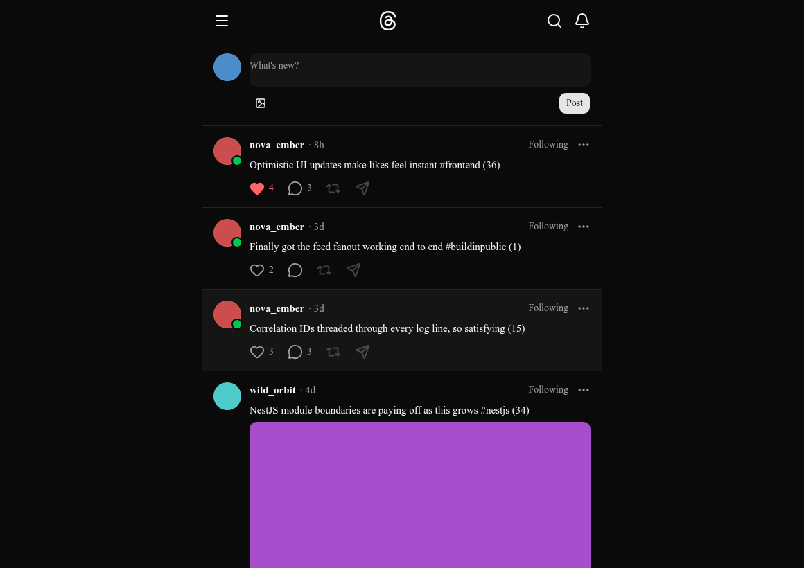
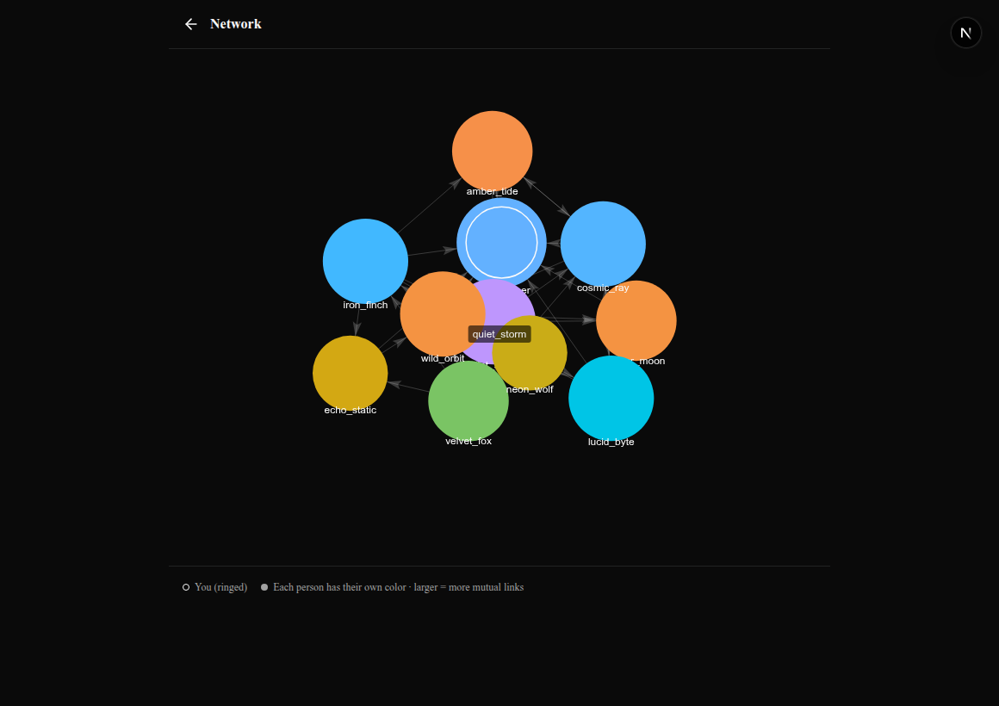
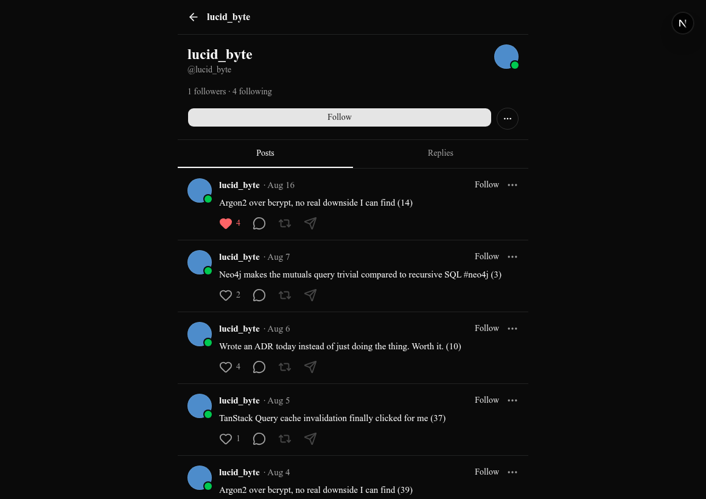
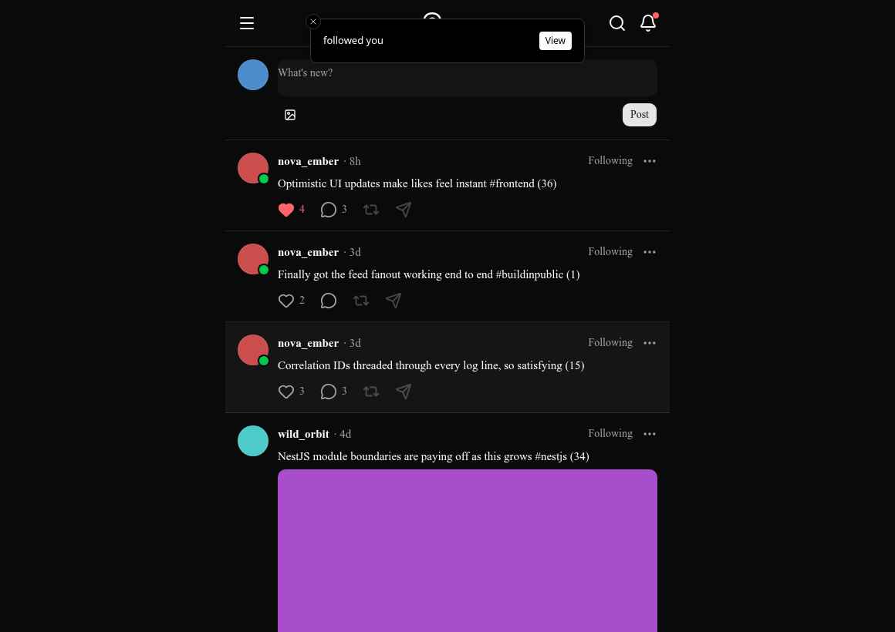
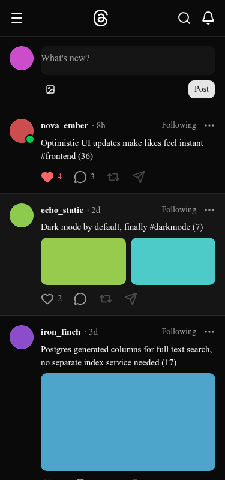
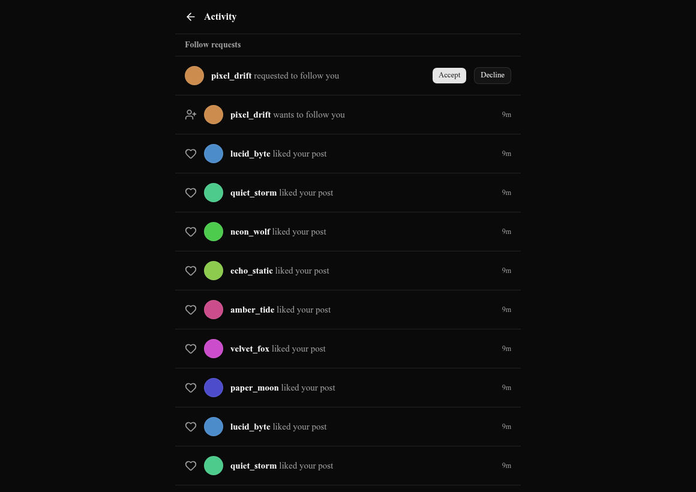
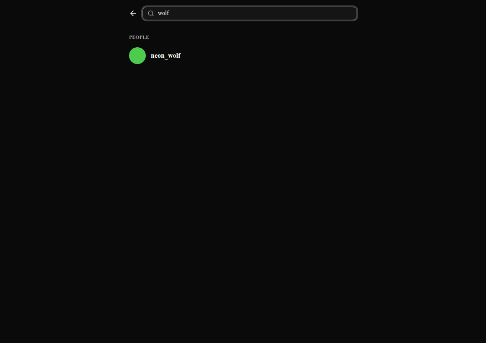

# Threads-clone

A Threads-style social platform built to demonstrate full-stack engineering depth: polyglot persistence, event-driven feed generation, real-time updates at socket scale, and a graph-powered social visualization — with a frontend held to the same bar as the backend.

This is a solo portfolio project. Full product/technical reasoning lives in [`docs/PROJECT_BRIEF.md`](docs/PROJECT_BRIEF.md); a diagrammed system tour is in [`docs/ARCHITECTURE.md`](docs/ARCHITECTURE.md); locked architectural decisions are in [`docs/DECISIONS.md`](docs/DECISIONS.md) and [`docs/adr/`](docs/adr/).



## Stack

**Backend** — NestJS (modular monolith) · PostgreSQL + Prisma · Neo4j · Redis · Socket.io + Redis adapter · BullMQ · AWS S3 (presigned uploads) · Sharp · JWT (RS256) + argon2

**Frontend** — Next.js 15 (App Router) · TanStack Query · Tailwind + shadcn/ui + base-ui · Framer Motion · react-hook-form + zod · Socket.io client · react-force-graph-2d

**Monorepo** — pnpm workspaces (`apps/api`, `apps/web`, `packages/shared-types`)

## Features

**Core** — registration/login, threaded posts and replies, likes, image uploads (up to 4 per post), profile pages with posts/replies/likes tabs

**Social graph** — follow/unfollow, private accounts with follow-request approval, block users, an interactive force-directed **Graph View** of your network powered by Neo4j

**Real-time** — live notifications (likes, replies, follows, follow requests) delivered over Socket.io with a durable fallback, toast notifications for high-signal events, online/offline presence dots on avatars

**Discovery** — Postgres full-text search across posts and users, trending hashtags scored with time decay in Redis

**Safety & moderation basics** — report posts, block accounts, private-account gating enforced consistently across feed/profile/search

**Polish** — skeleton loading states, optimistic updates on every mutation, Framer Motion transitions, mobile-first responsive layout (tested at 375/768/1440px), error boundaries + 404 page, Lighthouse-audited accessibility (100/100 on auth pages, 96/100 on the feed — the remaining item is a WCAG-exempt inline link, not a real barrier)

## Screenshots

<table>
<tr>
<td width="50%"><br /><sub>Graph View — force-directed network, powered by Neo4j</sub></td>
<td width="50%"><br /><sub>Profile tabs, with a live presence dot on the avatar</sub></td>
</tr>
<tr>
<td width="50%"><br /><sub>A follow notification arriving over the socket, live</sub></td>
<td width="50%"><br /><sub>375px mobile layout</sub></td>
</tr>
<tr>
<td width="50%"><br /><sub>Follow requests, with accept/decline in place</sub></td>
<td width="50%"><br /><sub>Postgres full-text search</sub></td>
</tr>
</table>

## Technical highlights

**Fanout-on-write feed (CQRS)** — posts are pushed into each follower's Redis-backed feed at write time, so a feed load is one cheap read instead of a fan-in query across everyone you follow. Accounts above a follower threshold skip fanout and are merged in at read time instead, to avoid write storms on high-follower accounts. → [ADR-003](docs/adr/003-fanout-on-write-feed.md)

**Durable-first async work** — nothing goes through BullMQ without being persisted to Postgres first in the same transaction as the triggering event. Workers are idempotent and retried with backoff; a periodic sweep re-enqueues anything stuck in a pending state. Postgres is the source of truth, the queue is just the fast path. → [ADR-009](docs/adr/009-async-reliability-durable-first.md)

**Polyglot persistence, each store for a reason** — Postgres for transactional data, Neo4j for graph traversal queries (mutuals, network visualization) that would be painful as recursive SQL, Redis for feed cache/trending/presence/rate limiting. → [ADR-002](docs/adr/002-polyglot-persistence.md), [ADR-007](docs/adr/007-neo4j-graph-queries.md)

**Real-time at socket scale** — Socket.io with a Redis adapter so the socket layer can scale horizontally; presence is tracked per-connection in Redis (not per-user) so multi-tab sessions behave correctly. → [ADR-005](docs/adr/005-realtime-transport.md)

**Auth done properly** — RS256 JWTs with separate access/refresh keypairs, refresh-token rotation with family-based reuse detection (a stolen refresh token gets the whole family revoked, not just itself), argon2 password hashing.

## Testing

Backend: 39 unit-test suites plus integration tests that spin up a real PostgreSQL container via Testcontainers (not mocked) and run actual Prisma migrations against it, plus an end-to-end auth flow test.

## Scope

DMs, communities/groups, algorithmic ranking, video, and i18n were never planned — the brief's own rule is that if a feature doesn't demonstrate a specific technical or product-craft skill, it doesn't go in. (Full list in `docs/PROJECT_BRIEF.md`.)

Reposts/quote-posts and @mentions *were* planned but didn't make the cut as priorities shifted toward real-time infrastructure, the graph view, and frontend polish instead — noted here rather than left for someone to discover by testing for them.

## Running locally

```bash
docker-compose up -d        # Postgres, Neo4j, Redis, MinIO, Mailhog
pnpm install
pnpm --filter api prisma:migrate:deploy
pnpm --filter api seed      # seeds 12 users, posts, replies, a private account + pending follow request
pnpm --filter api start:dev # http://localhost:3001
pnpm --filter web dev       # http://localhost:3000
```
