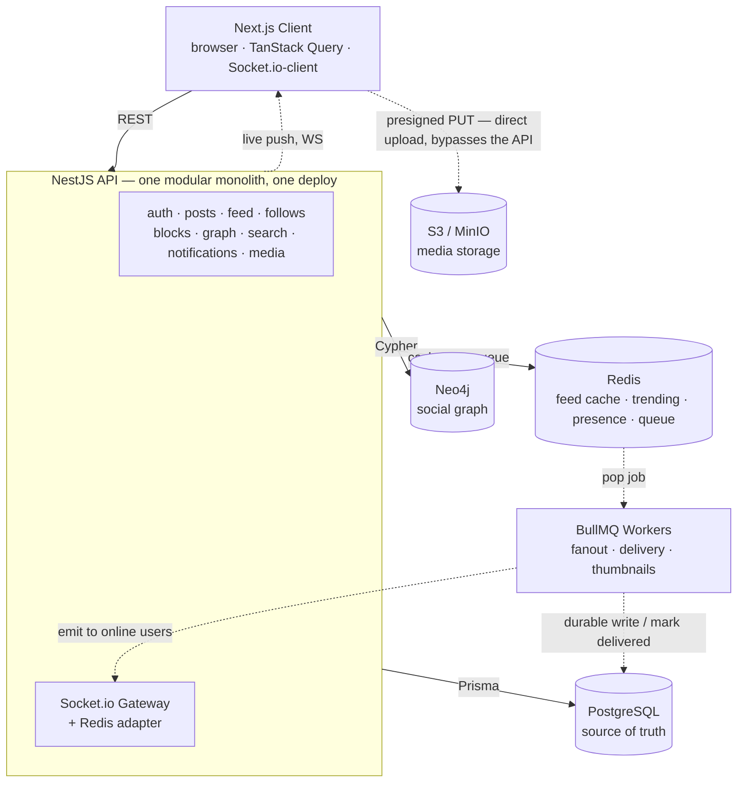
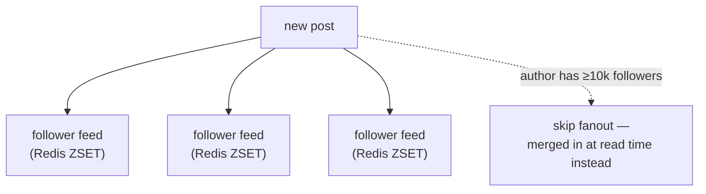
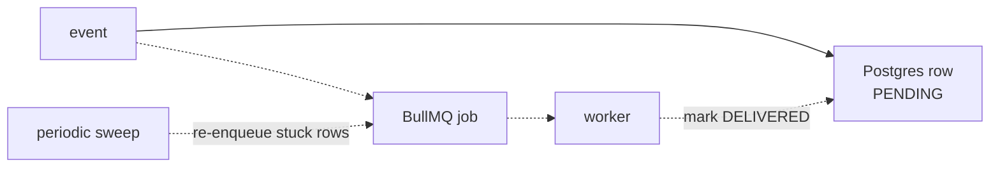
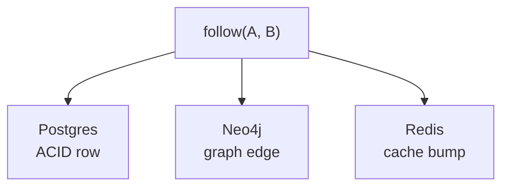
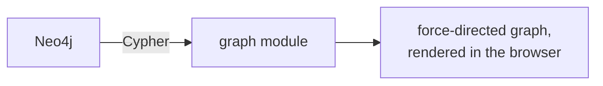

# Architecture

One NestJS service, three databases each doing the one thing they're good at, and a
background-worker lane that makes "real-time" and "reliable" stop fighting each other.

## The whole system, one request at a time

Solid arrows are things a request waits on. Dashed arrows are work that happens
*after* the response has already gone back to the browser — background jobs, live
pushes, the async half of the system.

The two dashed loops at the bottom are the same shape: a worker reads a job, writes
the durable result back to Postgres, and only *then* pushes it live over the socket
gateway. Nothing "real-time" in this app ever skips the database.

## What's actually the interesting part

Four decisions that aren't just "which library" — each is a real trade-off, made on
purpose, that doesn't show up in a feature list.

### 1. Fanout-on-write, except when that's a bad idea

Posting pushes the post ID into every follower's Redis-backed feed immediately, so
loading a feed is one cheap read — not a fan-in query across everyone you follow.
Accounts past a follower threshold skip that write storm entirely and get merged in
at read time instead. → [ADR-003](adr/003-fanout-on-write-feed.md)

### 2. Nothing "real-time" is allowed to be lossy

Every async job is preceded by a durable Postgres write, in the same transaction as
the event that caused it. Workers are idempotent and retry with backoff; a periodic
sweep re-enqueues anything still stuck `PENDING`. Postgres is the truth — the queue
is only the fast path. → [ADR-009](adr/009-async-reliability-durable-first.md)

### 3. Three databases, three different jobs

Postgres holds the transactional truth. Neo4j exists because "mutual followers
between A and B" and "second-degree connections" are one Cypher hop, not a recursive
CTE. Redis holds everything that's fast-changing and fine to lose: feed cache,
trending scores, presence, rate limits. → [ADR-002](adr/002-polyglot-persistence.md),
[ADR-007](adr/007-neo4j-graph-queries.md)

### 4. The social graph, drawn as an actual graph

Most apps show your network as a list. This one runs real Cypher traversals and
renders the result as an interactive force-directed graph — drag a node, and you're
looking at your actual mutuals and second-degree connections, not a mock.
→ [ADR-007](adr/007-neo4j-graph-queries.md)
